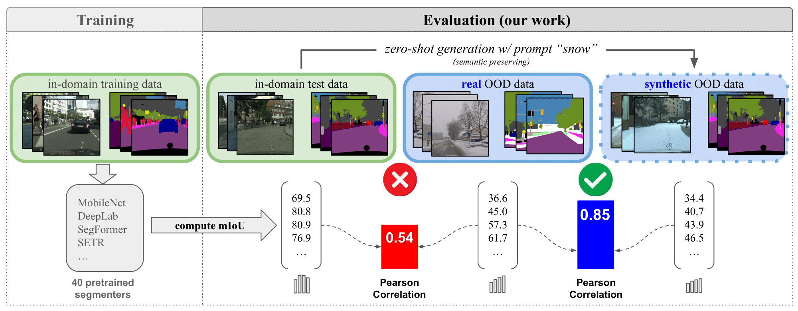

<div align="center">

# Reliability in Semantic Segmentation: Can We Use Synthetic Data? (ECCV 2024)

<strong>Thibaut Loiseau</strong>
·
<a href="https://tuanhungvu.github.io"><strong>Tuan-Hung Vu</strong></a>
·
<strong>Mickael Chen</strong>
·
<a href="https://ptrckprz.github.io"><strong>Patrick Pérez</strong></a>
·
<a href="https://cord.isir.upmc.fr"><strong>Matthieu Cord</strong></a>

</div>

<div align="center">
    <a href="https://arxiv.org/abs/2312.09231" class="button"><b>[Paper]</b></a> &nbsp;&nbsp;&nbsp;&nbsp;
    <a href="https://drive.google.com/drive/folders/1c3HthfWYrw_PEbf0eD2CRYp-xwYmxbLV?usp=sharing" class="button"><b>[Data]</b></a> &nbsp;&nbsp;&nbsp;&nbsp;
    <a href="https://drive.google.com/drive/folders/1BK1-I1uys0PN6U8KEVDjkLwMAQIbKJho?usp=sharing" class="button"><b>[Checkpoints]</b></a> &nbsp;&nbsp;&nbsp;&nbsp;
</div>

<br/>



# Getting started

## Clone repository:

    git clone https://github.com/valeoai/GenVal.git
    cd GenVal

## Datasets and checkpoints

Create the symlinks to [Cityscapes](https://www.cityscapes-dataset.com), [ACDC](https://acdc.vision.ee.ethz.ch) and [IDD](https://idd.insaan.iiit.ac.in):

    ln -s <cityscapes_path> datasets 
    ln -s <acdc_path> datasets
    ln -s <IDD_Segmentation_path> datasets

Then, create symlink or put the ControlNet checkpoint that you can download [here](https://drive.google.com/drive/folders/1BK1-I1uys0PN6U8KEVDjkLwMAQIbKJho?usp=sharing) in ``checkpoints/`` folder :

    ln -s <path_to_checkpoints> checkpoints

You can also find some data generated with our methods [here](https://drive.google.com/drive/folders/1c3HthfWYrw_PEbf0eD2CRYp-xwYmxbLV?usp=sharing). Just put both ``ood_objects`` and ``style_transfer`` folders in an ``images`` folder at the root of the repo. The style-transfer data was created using a ControlNet adapted for SD 1.5 on Cityscapes' segmentation masks.

</details>

<br/>

# 1. Style-transfer data generation

The style-transfer pipeline is based on the original repo of [ControlNet](https://github.com/lllyasviel/ControlNet).

To be able to train the ControlNet or use a pretrained one, and then generate new images using the semantic masks of Cityscapes, follow the following steps:

<details><summary><strong>Setup environment</strong></summary>
&emsp;

    cd ControlNet
    conda env create -f environment.yaml  # env name: control
    conda activate control

</details>

<br/>

<details><summary><strong>Captioning new dataset or use existing captions</strong></summary>
&emsp;

We need to get the captions of Cityscapes in order to train the ControlNet. The captioning is done with [CLIP-interrogator](https://github.com/pharmapsychotic/clip-interrogator). The captions are already stored under 

The captions for training are already stored under the ``training/`` folder in the ``.jsonl`` files, but if you want to rerun captioning on Cityscapes, you can run:

    pip install clip-interrogator==0.5.4
    python clip_int.py --dataset {dataset}

This will generate all captions for each training samples in the considered dataset (cityscapes, idd, acdc_fog, acdc_night, acdc_rain, acdc_snow) in a ``json`` file in a ``captions/`` folder. You will mainly need the captions of Cityscapes in order to train the ControlNet and performing inference, but you might want to use ACDC or IDD captions for other use.

</details>

<br/>

<details><summary><strong>Train the ControlNet or symlink a pretrained one</strong></summary>
&emsp;

- You can find a pretrained model on the semantic masks of Cityscapes [here](https://drive.google.com/drive/folders/1BK1-I1uys0PN6U8KEVDjkLwMAQIbKJho?usp=sharing) and put it in ``checkpoints/``.

- Otherwise, you can train the ControlNet yourself. You will first need to create the trainable copy of the encoder of the denoising U-Net of Stable Diffusion. 

First download the pretrained Stable Diffusion model (7.7 Gb):

    wget -P models/ https://huggingface.co/runwayml/stable-diffusion-v1-5/resolve/main/v1-5-pruned.ckpt

Then create the trainable copy doing:

    python tool_add_control.py models/v1-5-pruned.ckpt models/control_seg.ckpt

Finally, launch training (you will need 1 GPU with 40 Gb VRAM, or you can decrease the batch size and adapt the gradient accumulation):

    python train.py
    
The checkpoints during training will be stored in ``logs/{run_num}/lightning_logs/version_0/checkpoints/`` folder. You can also visualize the training advancement in ``logs/{run_num}/image_log/``

</details>

<br/>

<details><summary><strong>Generate images with transferred style</strong></summary>
&emsp;

The default checkpoint that is used to generate new samples is the pretrained one in ``checkpoints/controlnet_cs.ckpt``.

To generate 512 samples with fog, you can launch:

    python style_transfer.py --num_samples=512 --domain=fog

You can choose whatever domain you want by changing the ``--domain`` option above when launching the command.

This will create new samples in ``../images/style_transfer/`` folder, based on random examples from the validation set of Cityscapes, with the corresponding original images and ground truths in different subfolders.

</details>

<br/>

# 2. OOD data generation

To add OOD objects in real scenes, we devised a method using diffusion models, and especially the [StableDiffusionInpaintPipeline](https://huggingface.co/docs/diffusers/api/pipelines/stable_diffusion/inpaint) from HuggingFace.

The creation of the OOD dataset is done as follows:

<details><summary><strong>Create initial dataset</strong></summary>
&emsp;

    cd ood_objects
    python sd_inpaint.py

Based on the ``objects.txt`` file that contains a list of OOD objects for Cityscapes, this script will launch the generation of 512 images per object, and store them in ``images/ood_objects/with_positions`` folder, with one subfolder per object and three ``{i}.png``, ``{i}_gt.png`` and ``{i}_pos.json`` files with the generated image, the corresponding ground truth and the position and size of the added object, respectively.

</details>

<br/>

<details><summary><strong>Refine the intial dataset</strong></summary>
&emsp;

    python refine_gen_images.py

This script will take the previous generated images as input and the position and size of the added object, and refine the generated object so that the edited zone will blend better with its surrounding context. The refined images are stored in ``images/ood_objects/refined``.

</details>

<br/>

<details><summary><strong>Get masks</strong></summary>
&emsp;

This part uses [GroundedSAM](https://github.com/IDEA-Research/Grounded-Segment-Anything) as a mask extractor, to get the mask corresponding to the added objects. It uses a natural language query in the edited square zone of the refined images to extract the corresponding mask.

You need a custom environment to be able to use GroundedSAM, by doing the following:

    export CUDA_HOME=/your/path/to/cuda-11.8
    conda create -n grounded_sam python=3.9 -y
    conda activate grounded_sam
    pip install torch torchvision torchaudio --index-url https://download.pytorch.org/whl/cu118
    pip install -e Grounded-Segment-Anything/segment_anything
    pip install -e Grounded-Segment-Anything/GroundingDINO
    pip install --upgrade diffusers[torch]
    wget https://dl.fbaipublicfiles.com/segment_anything/sam_vit_h_4b8939.pth -P ../checkpoints
    wget https://github.com/IDEA-Research/GroundingDINO/releases/download/v0.1.0-alpha/groundingdino_swint_ogc.pth -P ../checkpoints

You can finally launch the mask extraction on the refined images:

    python get_masks.py

This will create a new folder in ``images/ood_objects/masks`` with ``.png`` files if the mask has been found, or an empty ``.txt`` file if the object has not been found by the model. By doing so, we can automatically filter images for which the object has not been generated.

Depending on the object, the pipeline might have different success rate.

</details>

<br/>

# 3. Evaluation of style-transfer data

In our study, we evaluate many Cityscapes pretrained models on the data we have created, concurrently with real data with the same domain shift. All models that are listed in ``path_dicts.py`` file can be downloaded from [here](https://github.com/open-mmlab/mmsegmentation/blob/0.x/docs/en/model_zoo.md), and put in the ``checkpoints/`` folder. We use ACDC and IDD for comparison.

The codebase for the evaluation is in the ``relis/`` folder of the repo, which is a modified version of the [this repo](https://github.com/naver/relis).

<details><summary><strong>Setup environment</strong></summary>
&emsp;

First, you need an environment to be able to evaluate all models on the different datasets. The relis repo is based on a modified version of [mmsegmentation](https://github.com/open-mmlab/mmsegmentation/tree/main) library, hence it is important to use the local version of mmsegmentation and not the official one.

    cd relis
    conda create -n openmmlab python=3.9 -y
    conda activate openmmlab
    pip install torch==1.11.0 torchvision --index-url https://download.pytorch.org/whl/cu115  # For CUDA 11.5
    pip install -r requirements.txt
    pip install -U openmim
    mim install mmengine
    mim install mmcv-full==1.5.0
    cd mmsegmentation
    pip install -v -e .
    cd ..

</details>

<br/>


<details><summary><strong>Robustness evaluation </strong></summary>
&emsp;

To evaluate the robustness of a particular model, you can:
1. Run the ``eval.py`` script with the following arguments:
    * ``--root_exp_dir``: the path where the results will be saved
    * ``--src_dataset``: the dataset to evaluate
    * ``--trg_dataset``: the dataset to evaluate
    * ``--model_arch``: the model architecture you want to evaluate, from the ``path_dicts.py`` file
    * ``--cond``: the conditions of the dataset to evaluate
    * ``--scene``: the scene(s) corresponding to the dataset to evaluate. Corresponds to the subfolders of each specific dataset, for example ``GOPRI`` for ACDC dataset.

    This script will create all the predictions for all images in the dataset to evaluate.

2. To aggregate results from all the previous predictions, run the ``compute_final_metrics.py`` script with the following arguments:
    * ``--src_dataset``: the dataset to evaluate
    * ``--trg_dataset``: the dataset to evaluate
    * ``--model_arch``: the model architecture you want to
    * ``--root_exp_dir``: the path to the previous results
    * ``--results_dir``: the path to which the final metrics will be saved
    * ``--scene``: the list of scenes from the dataset you want to evaluate, separated by commas
    * ``--cond``: the conditions corresponding to the scenes, separated by commas

    This will output the aggregated metrics in terms of pixel accuracy, mIoU, IoU per class, and more...

For more information, you can look at the [original repo](https://github.com/naver/relis).

</details>

<br/>

<details><summary><strong>Calibration evaluation and temperature scaling</strong></summary>
&emsp;

### Raw calibration evaluation after training

The process here is quite the same as when evaluating the robustness of models:

1. Launch ``extract_logits.py`` script with the same parameters as the ``eval.py`` above.
2. Launch ``eval_calibration.py`` script with the same parameters as ``compute_final_metrics.py`` above.

This will give results for raw calibration for all models, right after training.

### Temperature scaling with one parameter only (vanilla)

1. Launch ``extract_logits.py`` script with the same parameters as the ``eval.py`` above.
2. Launch ``extract_features.py`` script with the same parameters as the ``eval.py`` above.
3. Launch ``compute_clusters_temp_scaling.py`` script. You will need to give the paths of the logits and the features extracted previously to compute the temperature parameter. Add the parameter ``--n_clusters=1`` to get one temperature only.

This will give the optimal temperature parameter for the calibration set used during calibration.

### Calibration evaluation after temperature scaling.

Launch ``eval_calibration_clustering.py`` to evaluate the temperature extracted from one particular calibration set.

</details>

<br/>

# 4. Evaluation of OOD dataset

You can get all OOD metrics needed by launching the scripts ``ood_detection/main_gen_ood.py``. You need to tell what model you want to evaluate with the ``--model`` parameter.

<br/>

# 📖 Citation
Please consider citing our paper in your publications if the project helps your research. BibTeX reference is as follows.
```
@inproceedings{loiseau2024reliability,
  title={Reliability in Semantic Segmentation: Can We Use Synthetic Data?},
  author={Loiseau, Thibaut and Vu, Tuan-Hung and Chen, Mickael and P{\'e}rez, Patrick and Cord, Matthieu},
  booktitle={ECCV},
  year={2024}
}
```

# References

```
@inproceedings{zhang2023adding,
title={Adding conditional control to text-to-image diffusion models},
author={Zhang, Lvmin and Rao, Anyi and Agrawala, Maneesh},
booktitle={Proceedings of the IEEE/CVF International Conference on Computer Vision},
year={2023}
}
```
```
@InProceedings{deJorge_2023_CVPR,
author = {de Jorge, Pau and Volpi, Riccardo and Torr, Philip and Gregory, Rogez},
title = {Reliability in Semantic Segmentation: Are We on the Right Track?},
booktitle = {The IEEE Conference on Computer Vision and Pattern Recognition (CVPR)},
year = {2023}
}
```
```
@article{ren2024grounded,
title={Grounded sam: Assembling open-world models for diverse visual tasks},
author={Ren, Tianhe and Liu, Shilong and Zeng, Ailing and Lin, Jing and Li, Kunchang and Cao, He and Chen, Jiayu and Huang, Xinyu and Chen, Yukang and Yan, Feng and others},
journal={arXiv preprint arXiv:2401.14159},
year={2024}
}
```


<!-- <details><summary><strong> </strong></summary>
&emsp;

</details>

<br/> -->
