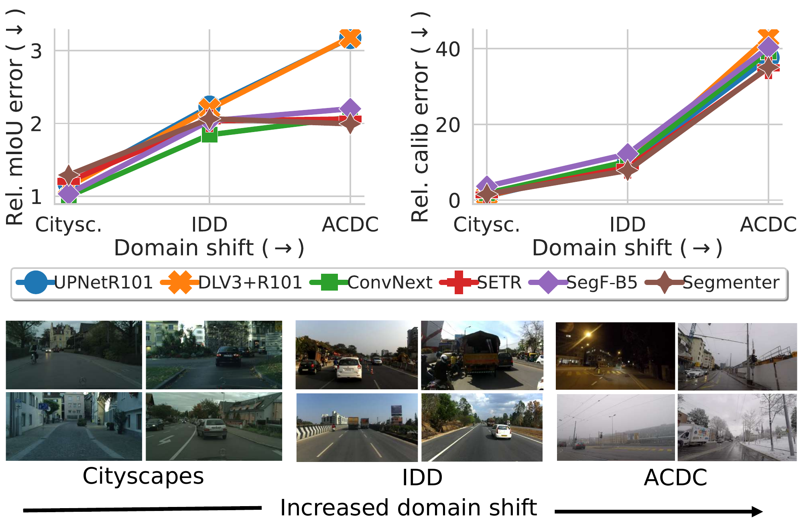

# Reliability in Semantic Segmentation: Are We on the Right Track?

[](https://www.python.org/)
[](https://pytorch.org)

This is a codebase to evaluate the robustness and uncertainty properties of semantic segmentation models as implemented in *Reliability in Semantic Segmentation: Are We on the Right Track? (CVPR 2023).*


<!--  -->

---

## Dependencies

This repo depends on two libraries that implement segmentation models, [`mmsegmentation`](https://github.com/open-mmlab/mmsegmentation) and [`detectron2`](https://github.com/facebookresearch/detectron2) (detectron2 is only needed for Mask2Former model, and can be ignored for all other models). Please refer to the requirements of mmsegmentation and detectron2 libraries for requirements.

> Note that the mmsegmentation folder included in this package contains modified files in order to measure uncertainty metrics, thus replacing it with the official mmsegmentation repository may break things.

---

## Datasets
The following datasets are used for training, calibration and evaluations:

- [Cityscapes](https://www.cityscapes-dataset.com)
- [IDD](https://idd.insaan.iiit.ac.in/)
- [ACDC](https://acdc.vision.ee.ethz.ch/login?target=%2Fdownload)
 
---

## Project structure

- **Data location.** Datasets should be downloaded from their respective websites (see above). Once datasets are ready, the file `path_dicts.py` should be modified to include the paths to the main folder of each dataset.

- **Model location.** Models should be either downloaded from the mmsegmentation or detectron2 repositories or trained locally. The file `path_dicts.py` should be modified to include the paths to the final checkpoint and config file for each model.

- **Launchers.** The folder `./launchers` contains several scripts that will automatically generate the commands to generate the results. Launch scripts are customizable to include different hyperparameter settings (e.g. use max prob or entropy as confidence). 

- **Experiment folder.** Variable `root_exp_dir` should be defined for each launch script to specify the folder where to save the experiment results.

---

## Evaluate model robustness 

To evaluate model robustess to distribution shifts two scripts should be used:

- `eval.py` will compute the model predictions for a given model and dataset folder
- `compute_final_metrics.py` will aggregate all predictions to provide mIoU and acc scores.

The intended usage is to run `eval.py` for each dataset scene separately (e.g. `aachen` for Cityscapes or `209` for IDD) so they can be processed in parallel to speed computations. Please refer to `launch_eval.py` and `launch_final_metrics.py` in `./launch` to generate the commands directly or as usage examples.

---

## Evaluate model uncertainty

We provide three different uncertainty metrics: Calibration, OOD detection (AUROC) and Misclassification (PRR) which are evaluated with `eval_calibrarion.py`, `eval_ood.py` and `eval_prr.py` respectively.

In order to evaluate the uncertainty however, the logits need to be computed first with `extract_logits.py`. 

The launch commands can be generated with `launch_extract_logits.py`, `launch_calib_metrics.py`, `launch_ood_metrics.py` and `launch_prr_metrics.py`.

> We also include a variant of local OOD detection where the unknown classes within an image are defined as OOD (as opposed to the whole image). See `eval_local_ood.py` and `launch_local_ood_metrics.py`

---

## Calibrate models

We also study different calibration strategies to improve uncertainty estimation.

### Clustering and temperature scaling

The script `compute_clusters_temp_scaling.py` can be used to calibrate models with temperature scaling. It splits the data into clusters based on image features and then computes the optimal temperature for each cluster. Prior to computing the clusters, image features need to be computed with `extract_features.py`.

> If the number of clusters is set to 1 this is equivalent to vanilla temperature scaling.

See `launch_extract_features.py`, `launch_compute_t_scaling.py` and `launch_compute_clusters_multiple_seeds.py`.

### Local temperature scaling

The script `train_lts_network.py` trains a network to predict a temperature value per-pixel. Commands can be generated with `launch_train_lts_network.py`.

---

## Reference

**Reliability in Semantic Segmentation: Are We on the Right Track?** (to appear at CVPR 2023)  
Pau de Jorge, Riccardo Volpi, Philip Torr and Grégory Rogez
```
    @InProceedings{deJorge_2023_CVPR,
    author = {de Jorge, Pau and Volpi, Riccardo and Torr, Philip and Gregory, Rogez},
    title = {Reliability in Semantic Segmentation: Are We on the Right Track?},
    booktitle = {The IEEE Conference on Computer Vision and Pattern Recognition (CVPR)},
    month = {June},
    year = {2023}
    }
```